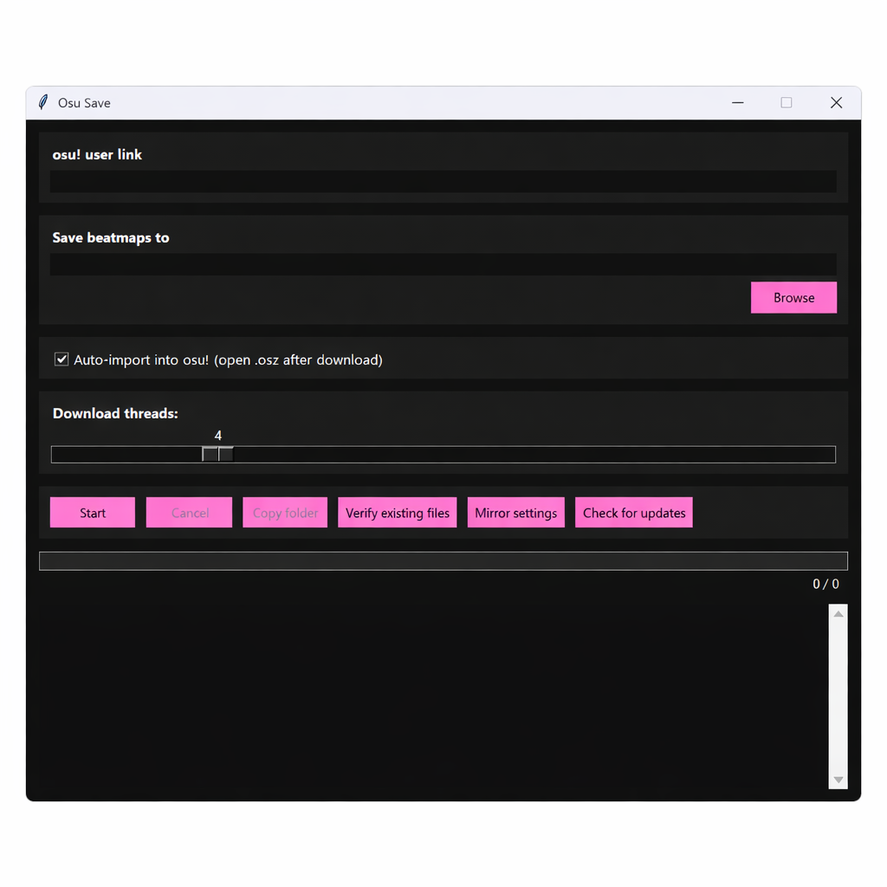

# Osu Save
### Automatically download, verify, and maintain your osu! beatmap collection  
Created by **MisterThs**

  

Osu Save is a modern desktop tool that helps you manage your osu! beatmaps with ease.  
It automatically downloads your **most played beatmapsets**, verifies your existing files, repairs corrupted maps, and keeps everything synced.

---

## 🚀 Features

### 🎵 Download your most‑played beatmaps  
Paste your osu! profile link → click **Start** → done.

### ⚡ Multi‑threaded downloads  
Choose how many threads you want (1–16) for maximum speed.

### 🔁 Mirror failover  
Automatically switches between:
- osu.direct  
- chimu.moe  
- nerinyan  

You can reorder mirror priority in the settings.

### 🧪 Integrity checker  
Detects:
- Corrupted `.osz` files  
- Missing files  
- Invalid ZIPs  
- Beatmaps without `.osu` files  

And automatically re-downloads them.

### 📦 Manifest sync  
Keeps track of what you’ve downloaded and removes missing entries.

### 🔄 Retry failed downloads  
One click to retry anything that didn’t download correctly.

### 🆕 Check for updates  
Built‑in update checker that compares your version with the latest GitHub release.

### 🎨 Clean dark UI  
Inspired by osu!lazer.

  

---

## 📥 Installation

### **Download the latest release**
👉 https://github.com/MisterThs/Osu-Save/releases/latest

### **Or build it yourself**
